## Author
author:
  name: Слабоспицкий Платон Сергеевич
  degrees: Бакалавр
  orcid: 0000-0002-0877-7063
  email: 1032253559@pfur.ru
  affiliation:
    - name: Российский университет дружбы народов
      country: Российская Федерация
      postal-code: 117198
      city: Москва
      address: ул. Миклухо-Маклая, д. 6

## Title
title: "Отчет по лабораторной номер 6"
subtitle: "Чистовой вариант"
license: "CC BY"
---

# Цель работы

Приобретение практических навыков взаимодействия пользователя с системой посредством командной строки.

# Задание

1.Выполнить навигацию по файловой системе.
2.Получить справочную информацию.
3.Выполнить управление каталогами.
4.Сделать анализ содержания каталогов.
5.Работа с history.
6.Комбинировать команды.

# Теоретическое введение

Команда **man** используется для просмотра (оперативная помощь) в диалоговом режиме руководства (manual) по основным командам операционной системы
типа Linux.
Формат команды:
`man <команда>`

Команда **cd** используется для перемещения по файловой системе операционной системы типа Linux.
Формат команды:
`cd [путь_к_каталогу]`

Команда **pwd**. Для определения абсолютного пути к текущему каталогу используется
команда *pwd* (print working directory).

Команда **ls**. Команда *ls* используется для просмотра содержимого каталога.
Формат команды:
`ls [-опции] [путь]`

Команда **mkdir**. Команда *mkdir* используется для создания каталогов.
Формат команды:
`mkdir имя_каталога1 [имя_каталога2...]`

Команда **rm**. Команда *rm* используется для удаления файлов и/или каталогов.
Формат команды:
`rm [-опции] [файл]`

Команда **history**. Для вывода на экран списка ранее выполненных команд используется команда history. Выводимые на экран команды в списке нумеруются. К любой
команде из выведенного на экран списка можно обратиться по её номеру в списке,
воспользовавшись конструкцией !<номер_команды>.

# Выполнение лабораторной работы

## Навигация по каталогам и работа с ними

Просмотрим название нашей домашней папки.
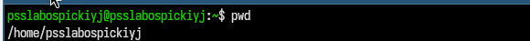

Перейдём в каталог *tmp* и посмотрим его содержимое с помощью команды *ls* и опции *-а*.

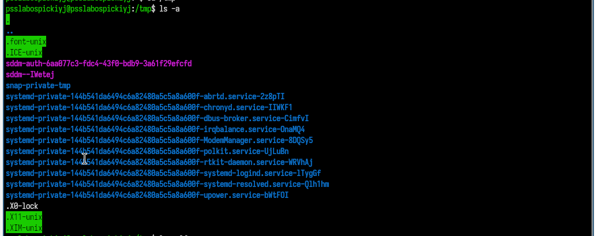

Посмотрим содержимое *tmp*, используя другие опции **ls**.
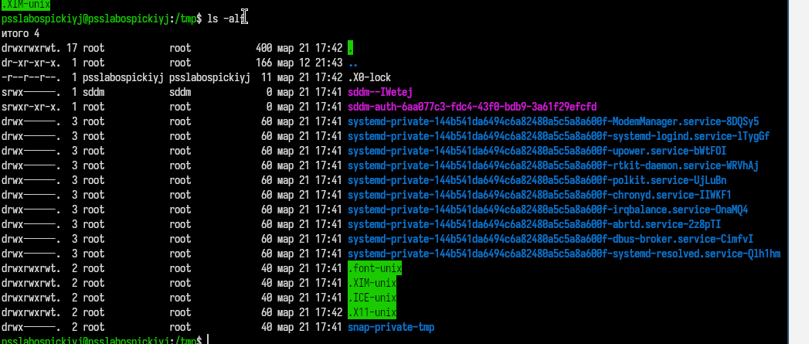
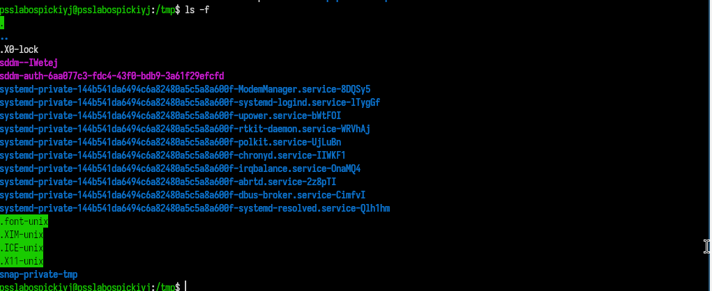
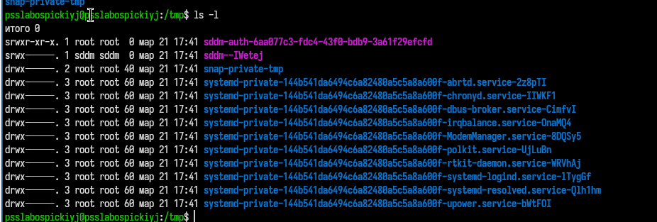

Какая же разница в выводе информации через разные опции?
`-a` - выводит все файлы, включая скрытые 
`-l` - выводит подробный список файлов
`-F` - выводит информацию с символами-указателями, чтобы сразу понять тип файла
`-alF` - включает в себя все предыдущие опции 

Определим, есть ли в каталоге */varn/spool* подкаталог *cron*.
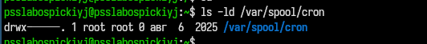

Перейдём в домашний каталог и выведем его содержимое.
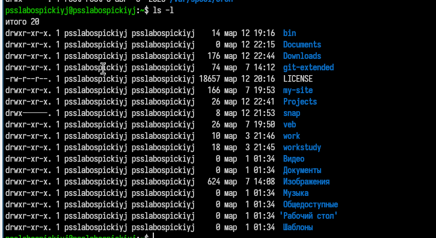}

Создали каталог *newdir* и в нём подкаталог *morefun*, также были созданы каталоги *letters*, *memos*., *misk*.
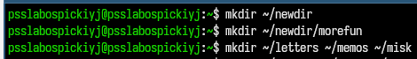

Удалили каталоги *letters*, *memos*., *misk*, попробовали удалить каталог *newdir* с помощью команды **rm**.
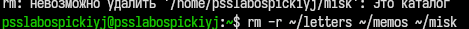

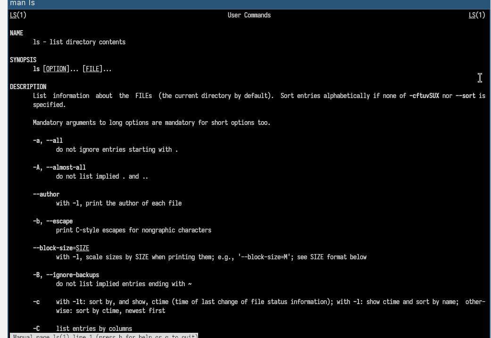}

Удалим каталог *newdir* с подкаталогом *morefun* с помощью команды **mrdir**.
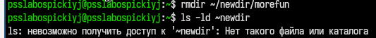

## Справочная информация

Вывели информацию о команде **ls** с помощью **man**.
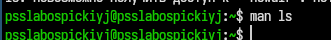

Вывели информацию о команде **cd** с помощью **man**.

Вывели информацию о команде **pwd** с помощью **man**.
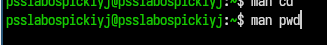

Вывели информацию о команде **mkdir** с помощью **man**.

Вывели информацию о команде **rmdir** с помощью **man**.

Вывели информацию о команде **rm** с помощью **man**.

## History

Вывели информацию о последних командах с помощью команды **history**.

## Комбинирование команд 

Что-то делаем.
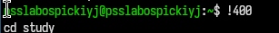
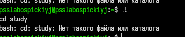
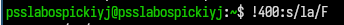

# Выводы

Приобрела практические навыки взаимодействия пользователя с системой посредством командной строки.

# Контрольные вопросы 

1.**Командная строка** - это текстовый интерфейс для управление системой через ввод команд.
2.**Абсолютный путь текущего каталога** - можно найти при помощи команды *pwd*.
3.**Определение типа файлов и их имена** - можно просмотреть при помощи команды *ls -F*.
4.**Показать скрытые файлы** можно при помощи команды *ls -a*.
5.**Удаление файла или каталога** :
  - *rm* удаляет файл
  - *rmdir* удаляет каталог
  - *rm -r* удаляет каталог с содержимым
6.**Историю команд** можно просмотреть с помощью команды *history*.
7.**Модифицированное выполнение из истории** :
    - !! повторить последнюю команду
    - !<номер команды в списке> - выполнить команду с введённым номером в списке
    - !<номер команды в списке>:s/<Что заменить>/<На что заменить>
8.**Пример:**
    `cd test; ls`
9.**Экранирование** - отмена служебного значения символа с помощью "\".
Пример: `cat Downloads/homework.txt `
10.**Вывод ls -l** - подробный список(права, ссылки, владелец, размер, дата, имя).
11.**Относительный путь** - путь от текущей папки.
12.**Информация о команде** - производится с помощью команды *man*.
13.**Для автоматического дополнения вводимых команд** используется клавиша `Tab`.

::: {#refs}
:::
