---
## Author
author:
  name: Слабоспицкий Платон Сергеевич
  degrees: DSc
  orcid: 0000-0002-0877-7063
  email: 1032253559@rudn.ru
  affiliation:
    - name: Российский университет дружбы народов
      country: Российская Федерация
      postal-code: 117198
      city: Москва
      address: ул. Миклухо-Маклая, д. 6

## Title
title: "Лабораторная работа №7"
subtitle: "дисциплина: Архитектура компьютеров"
license: "CC BY"
---

# Цель работы

Ознакомление с файловой системой Linux, её структурой, именами и содержанием каталогов. Приобретение практических навыков по применению команд для работы с файлами и каталогами, по управлению процессами (и работами), по проверке использования диска и обслуживанию файловой системы.

# Задание

1. Выполните все примеры, приведённые в первой части описания лабораторной работы.

2. Выполните следующие действия, зафиксировав в отчёте по лабораторной работе используемые при этом команды и результаты их выполнения:

2.1. Скопируйте файл /usr/include/sys/io.h в домашний каталог и назовите его equipment. Если файла io.h нет, то используйте любой другой файл в каталоге /usr/include/sys/ вместо него.

2.2. В домашнем каталоге создайте директорию ~/ski.plases.

2.3. Переместите файл equipment в каталог ~/ski.plases.

2.4. Переименуйте файл ~/ski.plases/equipment в ~/ski.plases/equiplist.

2.5. Создайте в домашнем каталоге файл abc1 и скопируйте его в каталог ~/ski.plases, назовите его equiplist2.

2.6. Создайте каталог с именем equipment в каталоге ~/ski.plases.

2.7. Переместите файлы ~/ski.plases/equiplist и equiplist2 в каталог ~/ski.plases/equipment.

2.8. Создайте и переместите каталог ~/newdir в каталог ~/ski.plases и назовите его plans.

3. Определите опции команды chmod, необходимые для того, чтобы присвоить перечисленным ниже файлам выделенные права доступа, считая, что в начале таких прав нет:

3.1. drwxr--r-- ... australia

3.2. drwx--x--x ... play

3.3. -r-xr--r-- ... my_os

3.4. -rw-rw-r-- ... feathers

При необходимости создайте нужные файлы.

4. Проделайте приведённые ниже упражнения, записывая в отчёт по лабораторной работе используемые при этом команды:

4.1. Просмотрите содержимое файла /etc/password.

4.2. Скопируйте файл ~/feathers в файл ~/file.old.

4.3. Переместите файл ~/file.old в каталог ~/play.

4.4. Скопируйте каталог ~/play в каталог ~/fun.

4.5. Переместите каталог ~/fun в каталог ~/play и назовите его games.

4.6. Лишите владельца файла ~/feathers права на чтение.

4.7. Что произойдёт, если вы попытаетесь просмотреть файл ~/feathers командой
cat?

4.8. Что произойдёт, если вы попытаетесь скопировать файл ~/feathers?

4.9. Дайте владельцу файла ~/feathers право на чтение.

4.10. Лишите владельца каталога ~/play права на выполнение.

4.11. Перейдите в каталог ~/play. Что произошло?

4.12. Дайте владельцу каталога ~/play право на выполнение.

5. Прочитайте man по командам mount, fsck, mkfs, kill и кратко их охарактеризуйте,
приведя примеры.

# Теоретическое введение

Файловая система в Linux состоит из фалов и каталогов. Каждому физическому носителю соответствует своя файловая система. Существует несколько типов файловых систем. Перечислим наиболее часто встречающиеся типы: – ext2fs (second extended filesystem); – ext2fs (third extended file system); – ext4 (fourth extended file system); – ReiserFS; – xfs; – fat (file allocation table); – ntfs (new technology file system). Для просмотра используемых в операционной системе файловых систем можно воспользоваться командой mount без параметров.

# Выполнение лабораторной работы
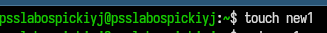{}

{}

{}

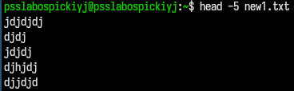{}

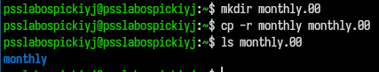{}

{}

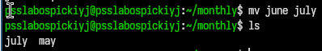{}

{}

{}

{}

{}

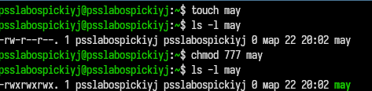{}

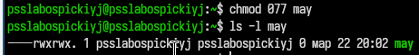{}

{}

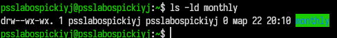{}

{}

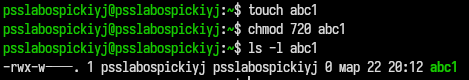{}

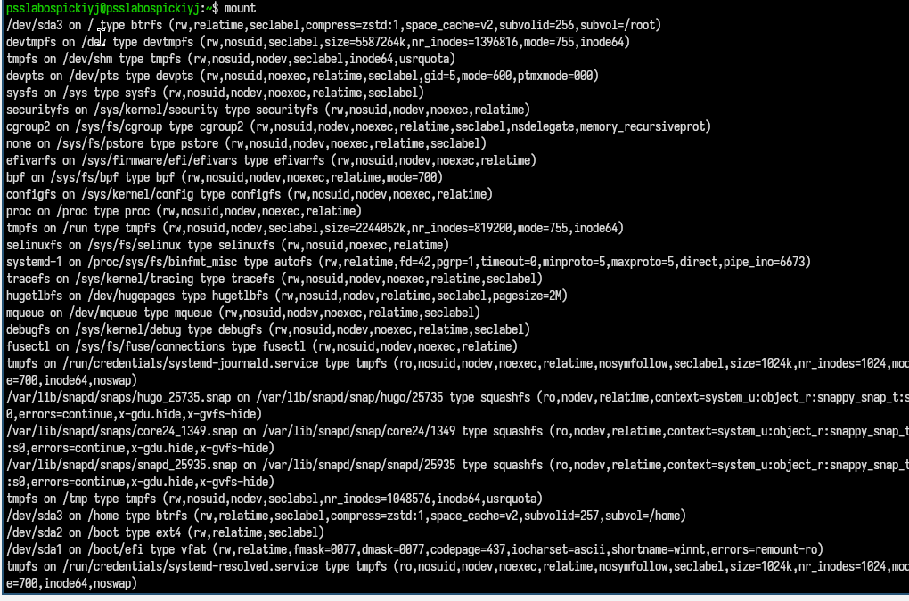{}

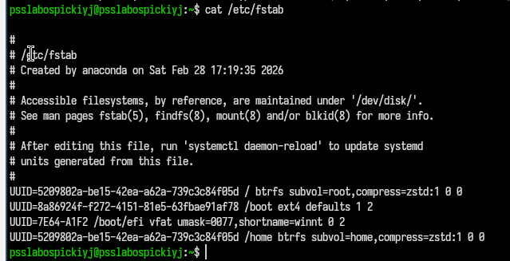{}

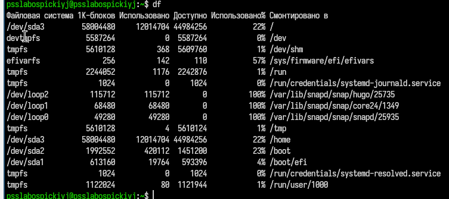{}

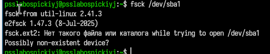{}

# Контрольные вопросы 

1. Дайте характеристику каждой файловой системе, существующей на жёстком диске компьютера, на котором вы выполняли лабораторную работу.

На компьютере используются файловые системы, такие как ext4 (основная файловая система Linux, поддерживает журналирование), tmpfs (временная файловая система в оперативной памяти), proc и sysfs (виртуальные файловые системы для доступа к информации о системе и процессах). Каждая из них имеет своё назначение: хранение данных, работа с устройствами или предоставление системной информации.

2. Приведите общую структуру файловой системы и дайте характеристику каждой директории первого уровня этой структуры.

Файловая система Linux имеет древовидную структуру с корневым каталогом /. Основные директории:

/home — домашние каталоги пользователей
/root — каталог администратора
/etc — конфигурационные файлы
/bin, /usr/bin — исполняемые файлы
/var — изменяемые данные (логи и др.)
/tmp — временные файлы
/dev — файлы устройств
/proc, /sys — информация о системе

3. Какая операция должна быть выполнена, чтобы содержимое некоторой файловой системы было доступно операционной системе?

Необходимо выполнить операцию монтирования файловой системы с помощью команды mount.

4. Назовите основные причины нарушения целостности файловой системы. Как устранить повреждения файловой системы?

Причины: сбои питания, ошибки оборудования, некорректное завершение работы системы, ошибки программ.
Устранение: проверка и восстановление с помощью команды fsck.

5. Как создаётся файловая система?

Файловая система создаётся с помощью команды mkfs, которая форматирует устройство и создаёт структуру хранения данных.

6. Дайте характеристику командам для просмотра текстовых файлов.

Команды:

cat — выводит весь файл
less — постраничный просмотр
head — показывает начало файла
tail — показывает конец файла
7. Приведите основные возможности команды cp в Linux.

Команда cp используется для копирования файлов и каталогов, поддерживает копирование нескольких файлов, рекурсивное копирование каталогов (-r), а также запрос подтверждения при перезаписи (-i).

8. Приведите основные возможности команды mv в Linux.

Команда mv используется для перемещения и переименования файлов и каталогов, позволяет переносить объекты между каталогами и изменять их имена.

9. Что такое права доступа? Как они могут быть изменены?

Права доступа — это разрешения на чтение (r), запись (w) и выполнение (x) для владельца, группы и остальных пользователей.
Изменяются с помощью команды chmod в символьной или числовой форме.

# Выводы

В результате выполнения лабораторной работы я ознакомился с файловой системой Linux, её структурой, именами и содержанием каталогов, приобрел навыки по применению команд для работы с файлами и каталогами, по управлению процессами (и работами), по проверке использования диска и обслуживанию файловой системы.

# Список литературы{.unnumbered}

::: {#refs}
:::
