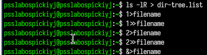
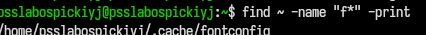
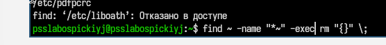
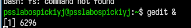
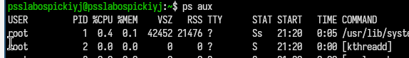
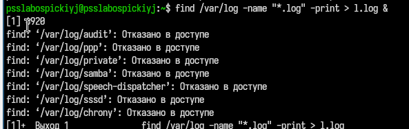

---
## Author
author:
  name: Слабоспицкий Платон Сергеевич
  degrees: DSc
  orcid: 0000-0002-0877-7063
  email: 1032253559@rudn.ru
  affiliation:
    - name: Российский университет дружбы народов
      country: Российская Федерация
      postal-code: 117198
      city: Москва
      address: ул. Миклухо-Маклая, д. 6

## Title
title: "Лабораторная работа №8"
subtitle: "дисциплина: Архитектура компьютеров"
license: "CC BY"
---

# Цель работы

Ознакомление с инструментами поиска файлов и фильтрации текстовых данных. Приобретение практических навыков: по управлению процессами (и заданиями), по проверке использования диска и обслуживанию файловых систем.

# Задание

1. Осуществите вход в систему, используя соответствующее имя пользователя.

2. Запишите в файл file.txt названия файлов, содержащихся в каталоге /etc. Допишите в этот же файл названия файлов, содержащихся в вашем домашнем каталоге.

3. Выведите имена всех файлов из file.txt, имеющих расширение .conf, после чего запишите их в новый текстовой файл conf.txt.

4. Определите, какие файлы в вашем домашнем каталоге имеют имена, начинавшиеся с символа c? Предложите несколько вариантов, как это сделать.

5. Выведите на экран (по странично) имена файлов из каталога /etc, начинающиеся с символа h.

6. Запустите в фоновом режиме процесс, который будет записывать в файл ~/logfile файлы, имена которых начинаются с log.

7. Удалите файл ~/logfile.

8. Запустите из консоли в фоновом режиме редактор gedit. 

9. Определите идентификатор процесса gedit, используя команду ps, конвейер и фильтр grep. Как ещё можно определить идентификатор процесса?

10. Прочтите справку (man) команды kill, после чего используйте её для завершения процесса gedit.

11. Выполните команды df и du, предварительно получив более подробную информацию об этих командах, с помощью команды man.

12. Воспользовавшись справкой команды find, выведите имена всех директорий, имеющихся в вашем домашнем каталоге.

# Теоретическое введение

В системе по умолчанию открыто три специальных потока: – stdin — стандартный поток ввода (по умолчанию: клавиатура), файловый дескриптор 0; – stdout — стандартный поток вывода (по умолчанию: консоль), файловый дескриптор 1; – stderr — стандартный поток вывод сообщений об ошибках (по умолчанию: консоль), файловый дескриптор 2. Большинство используемых в консоли команд и программ записывают результаты своей работы в стандартный поток вывода stdout. Например, команда ls выводит в стандартный поток вывода (консоль) список файлов в текущей директории. Потоки вывода и ввода можно перенаправлять на другие файлы или устройства. Проще всего это делается с помощью символов >, >>, <, <<. Конвейер (pipe) служит для объединения простых команд или утилит в цепочки, в ко- торых результат работы предыдущей команды передаётся последующей. Команда find используется для поиска и отображения на экран имён файлов, соответствующих заданной строке символов.

# Выполнение лабораторной работы

1. Поиск файлов, начинающихся на "p", в каталоге /etc
Выполнен поиск файлов и каталогов в /etc, имена которых начинаются с буквы p. Результат показал два найденных пути: policy.xml в каталоге ImageMagick и nre-down_d в NetworkManager.

2. Создание полного списка файлов с перенаправлением вывода
С помощью ls -lR > dir-tree.list создан рекурсивный список содержимого домашнего каталога с сохранением в файл. Далее выполнены эксперименты с перенаправлением:

1>filename — перенаправление стандартного вывода (файл перезаписан).

2>filename — перенаправление стандартного вывода ошибок.

2>>filename — добавление ошибок в файл.

&>>filename — перенаправление и stdout, и stderr в файл с добавлением.

3. Сортировка вывода команды ls
Выполнена команда ls -la | sort > sortilg_list. Вывод подробного списка файлов отсортирован и записан в файл sortilg_list.

4. Поиск файлов по шаблону "f*k" в домашнем каталоге
Команда find ~ -name "f*k" -print нашла один объект: .cache/fontconfig (вероятно, каталог). Имя пользователя в приглашении отличается от других скриншотов, что может указывать на другую сессию.

5. Удаление временных файлов (содержащих "~") и обработка ошибок доступа
При попытке find /etc -name "p*" возникла ошибка отказа доступа к /etc/liboatth. Затем выполнена команда find ~ -name "*~" -exec rm "{}" \; для удаления всех резервных копий (файлов, оканчивающихся на ~) в домашнем каталоге.

6. Поиск строки "begin" в файлах, начинающихся на f
Команда grep begin f* ищет слово "begin" во всех файлах текущего каталога, чьи имена начинаются с буквы f.

7. Фильтрация вывода ls через grep
С помощью ls -l | grep na6 выполнен поиск строки "na6" в подробном списке файлов текущего каталога.

8. Проверка использования inode и дискового пространства
Команда df -vi показала информацию об inode и точках монтирования.

9. Оценка размера домашнего каталога
Выведен размер каталога /home/psslabospickiyj/ (1472784) с помощью предыдущей команды, затем выполнена du -a ~/ для отображения размера каждого файла в домашнем каталоге.

10. Проверка квот файловой системы
Снова отобразился размер домашнего каталога, после чего введена команда fs quota (вероятно, утилита для просмотра квот). Результат на скриншоте не показан.

11. Запуск процесса в фоне
Выполнена команда getid &. Система присвоила фоновому процессу идентификатор (PID) 6296.

12. Просмотр списка процессов
Команда ps aux вывела список всех запущенных процессов с подробной информацией: PID, %CPU, %MEM, TTY, STAT, START, TIME, COMMAND. Показаны процессы systemd и kthreadd.

13. Поиск .log файлов в /var/log с перенаправлением в фоне
Команда find /var/log -name "*.log" -print > 1.log & запущена в фоне (PID 920). При выполнении возникли ошибки отказа доступа к нескольким каталогам (audit, ppp, private, samba, speech-dispatcher, sssd, chrony). По завершении команда вернула код выхода 1.

# Выводы

В процессе выполнения лабораторной работы я ознакомился с инструментами поиска файлов и фильтрации текстовых данных, приобрел практические навыки: по управлению процессами (и заданиями), по проверке использования диска и обслуживанию файловых систем.

# Список литературы{.unnumbered}

::: {#refs}
:::
